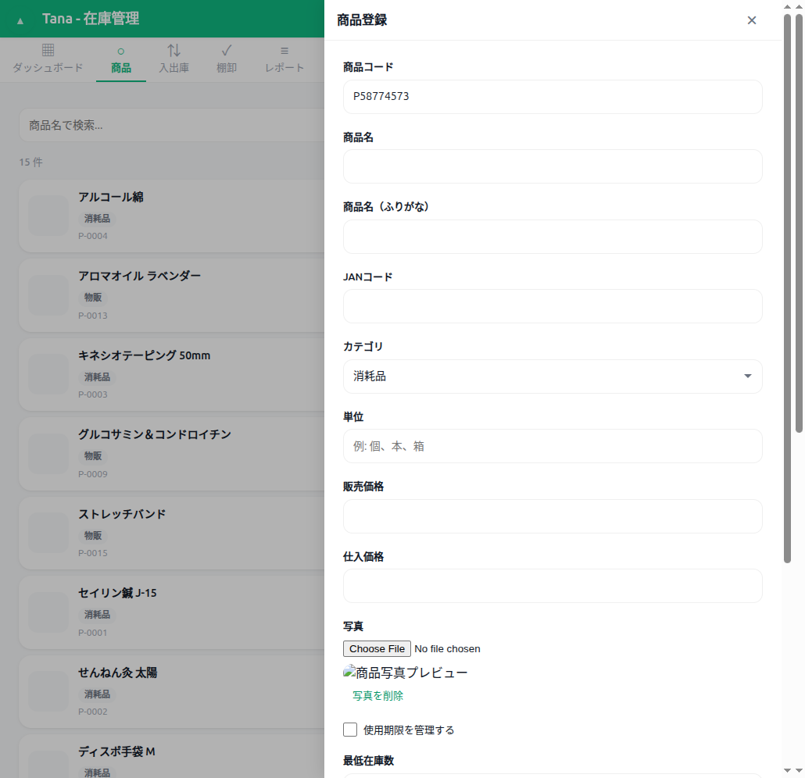
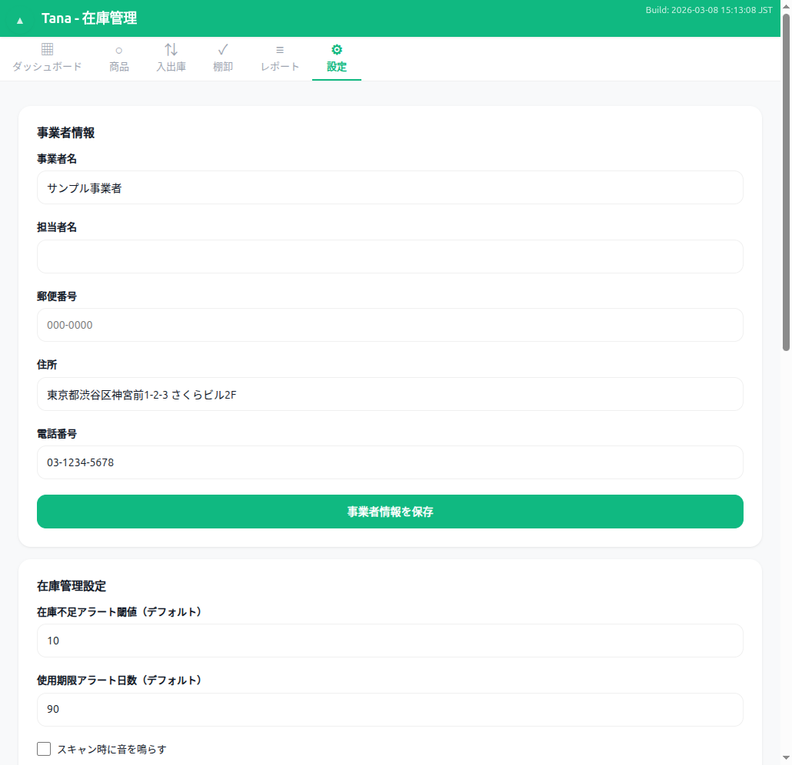

# ユーザーマニュアル — Tana 在庫管理

## 目次

1. [はじめに](#1-はじめに)
   - 1.1 Tana とは
   - 1.2 特徴
   - 1.3 動作環境
   - 1.4 ホーム画面への追加
2. [画面構成](#2-画面構成)
   - 2.1 メインタブナビゲーション
   - 2.2 共通UI要素
3. [商品管理](#3-商品管理)
   - 3.1 商品一覧
   - 3.2 商品の登録
   - 3.3 商品の編集
   - 3.4 商品の削除
   - 3.5 商品の検索・フィルター
   - 3.6 商品詳細の確認
   - 3.7 写真の設定
4. [バーコードスキャン](#4-バーコードスキャン)
   - 4.1 スキャンの開始
   - 4.2 バーコードの読み取り
   - 4.3 対応バーコード形式
   - 4.4 スキャン音の設定
5. [入出庫記録](#5-入出庫記録)
   - 5.1 入出庫タブの構成
   - 5.2 入庫（仕入れ）の記録
   - 5.3 使用の記録
   - 5.4 販売の記録
   - 5.5 取引履歴の確認
   - 5.6 バーコードスキャンによるクイック入出庫
6. [棚卸](#6-棚卸)
   - 6.1 棚卸の開始
   - 6.2 実数の入力
   - 6.3 棚卸の確定
   - 6.4 棚卸の中止
   - 6.5 棚卸履歴
7. [レポート](#7-レポート)
   - 7.1 在庫一覧レポート
   - 7.2 入出庫履歴レポート
   - 7.3 使用期限レポート
   - 7.4 棚卸差異レポート
8. [設定](#8-設定)
   - 8.1 クリニック・サロン情報
   - 8.2 在庫管理設定
   - 8.3 通知設定
   - 8.4 アプリ情報
9. [データ管理](#9-データ管理)
   - 9.1 データエクスポート（バックアップ）
   - 9.2 データインポート（復元）
   - 9.3 サンプルデータ投入
   - 9.4 全データ削除
10. [オフライン利用](#10-オフライン利用)
    - 10.1 仕組み
    - 10.2 データの保存場所
    - 10.3 アプリの更新
    - 10.4 注意事項
11. [よくある質問・トラブルシューティング](#11-よくある質問・トラブルシューティング)

---

## 1. はじめに

### 1.1 Tana とは

Tana は治療院・サロン向けの在庫管理アプリです。施術で使う消耗品（オイル、テープ、タオルなど）と、お客様に販売する物販商品（シャンプー、サプリメントなど）の2カテゴリに分けて在庫を管理できます。

ブラウザだけで動作するため、専用のソフトウェアをインストールする必要はありません。スマートフォン、タブレット、PC のいずれからでもすぐに利用を開始できます。

### 1.2 特徴

- **完全無料・オープンソース**: 料金は一切かかりません。
- **アカウント登録不要**: メールアドレスやパスワードの登録なしで使い始められます。
- **オフライン対応（PWA）**: 初回アクセス後はインターネットに接続していなくても利用可能です。
- **データは端末内に保存**: すべてのデータはブラウザ内（IndexedDB）に保存されます。外部サーバーにデータが送信されることはありません。
- **バーコードスキャン対応**: スマートフォンのカメラで商品バーコード（JAN コード）を読み取り、商品を素早く特定できます。
- **モバイル・PC 両対応**: レスポンシブデザインにより、画面サイズに応じたレイアウトで表示されます。

### 1.3 動作環境

| ブラウザ         | 対応状況 | 備考                                   |
|-----------------|---------|----------------------------------------|
| Google Chrome   | 推奨    | デスクトップ版・モバイル版ともに推奨        |
| Safari          | 対応    | iOS でのカメラスキャンに対応              |
| Microsoft Edge  | 対応    | Chromium ベースのバージョンが必要          |
| Firefox         | 対応    | PWA インストール機能に一部制限あり         |

**対応端末**: スマートフォン（iPhone / Android）、タブレット（iPad / Android タブレット）、PC・ノートPC

**推奨画面サイズ**: 幅 320px 以上（縦向き推奨）

### 1.4 ホーム画面への追加

Tana は PWA（Progressive Web App）としてホーム画面に追加できます。追加すると、通常のアプリと同じようにアイコンから起動でき、ブラウザのアドレスバーが非表示になります。

**Chrome（Android）の場合:**

1. Tana をブラウザで開く
2. ブラウザの右上メニュー（三点アイコン）をタップ
3. 「ホーム画面に追加」または「アプリをインストール」を選択
4. 表示名を確認して「追加」をタップ
5. ホーム画面に「Tana」アイコンが追加される

**Safari（iPhone / iPad）の場合:**

1. Tana を Safari で開く
2. 画面下部の共有ボタン（四角に上矢印のアイコン）をタップ
3. 「ホーム画面に追加」を選択
4. 表示名を確認して「追加」をタップ
5. ホーム画面に「Tana」アイコンが追加される

**Chrome（PC）の場合:**

1. Tana をブラウザで開く
2. アドレスバー右端のインストールアイコンをクリック
3. 「インストール」をクリック

---

## 2. 画面構成

### 2.1 メインタブナビゲーション

Tana は 6 つのメインタブで構成されています。画面上部のタブナビゲーションで切り替えます。

| タブ           | 機能概要                                         |
|---------------|------------------------------------------------|
| ダッシュボード  | アラート表示、サマリー情報、クイックアクション        |
| 商品           | 商品マスターの登録・編集・検索・削除                 |
| 入出庫         | 入庫・使用・販売の記録と取引履歴の確認               |
| 棚卸           | 実地棚卸の開始・実施・確定と棚卸履歴の確認            |
| レポート       | 在庫一覧・入出庫履歴・使用期限・棚卸差異の各種レポート  |
| 設定           | 施設情報・在庫設定・通知設定・データ管理              |


### 2.2 共通UI要素

**トースト通知**: 操作の成功・失敗を画面上部にメッセージで表示します。数秒後に自動で消えます。

**確認ダイアログ**: データの削除やインポートなど重要な操作では、確認ダイアログが表示されます。「OK」で続行、「キャンセル」で中止できます。

**スクロールトップボタン**: 画面を下にスクロールすると、右下に「ページ上部へ戻る」ボタンが表示されます。

**PWA 更新バナー**: アプリの新しいバージョンが利用可能になると、画面上部に黄色いバナーが表示されます。「更新する」ボタンをタップすると最新版に更新されます。

---

## 3. 商品管理

### 3.1 商品一覧

「商品」タブを選択すると、登録済みの全商品が一覧で表示されます。

- 各商品はカード形式で表示され、写真・商品名・カテゴリ・商品コード・現在在庫数が確認できます。
- 在庫数は色分けで状態を示します:
  - **通常**（緑系）: 最低在庫数を上回っている
  - **在庫不足**（黄〜橙系）: 最低在庫数以下
  - **在庫なし**（赤系）: 在庫が 0 以下
- 商品名の五十音順でソートされます。
- ツールバーに「商品追加」ボタン、検索バー、カテゴリフィルターがあります。
- 一覧の下部には該当件数が表示されます。


### 3.2 商品の登録

1. 「商品」タブを開く
2. ツールバーの「商品追加」ボタンをタップ
3. 商品登録フォーム（オーバーレイ）が表示される
4. 以下の項目を入力する:

| フィールド       | 必須/任意 | 説明                                                 | 入力制約                    |
|-----------------|----------|------------------------------------------------------|---------------------------|
| 商品コード       | 自動     | 新規登録時は自動で生成される                             | 編集時は変更不可            |
| 商品名           | 必須     | 商品の名前                                            | 1〜100 文字               |
| 商品名（カナ）    | 任意     | 検索用のふりがな                                       | ひらがなのみ               |
| JAN コード       | 任意     | バーコードの番号                                       | JAN-8（8桁）またはJAN-13（13桁）、チェックデジット検証あり |
| カテゴリ         | 必須     | 商品の種別                                            | 「消耗品」または「物販」     |
| 単位             | 任意     | 在庫の数え方                                          | 例: 個、本、箱、枚          |
| 販売価格         | 任意     | 販売時の価格（円）                                     | 0 以上の数値               |
| 仕入価格         | 任意     | 仕入れ時の単価（円）                                   | 0 以上の数値               |
| 写真             | 任意     | 商品の写真                                            | カメラ撮影またはギャラリーから選択 |
| 使用期限を管理する | 任意     | チェックを入れるとロット番号・使用期限の追跡が有効になる   | チェックボックス            |
| 期限アラート日数   | 任意     | 使用期限の何日前からアラートを表示するか                  | 0 以上の整数（デフォルト: 30） |
| 最低在庫数        | 任意     | この数を下回ると在庫不足アラートが表示される              | 0 以上の整数               |
| 仕入先           | 任意     | 仕入先の名前                                          | テキスト                   |
| 備考             | 任意     | メモ欄                                               | テキスト                   |

5. 入力が完了したら「保存」ボタンをタップ
6. バリデーションが通ると商品が登録され、商品一覧に戻る
7. エラーがある場合はトースト通知でエラー内容が表示される



**注意事項:**
- 商品コードは自動で採番されます（P-0001 形式）。手動での変更は新規登録時のみ可能です。
- JAN コードを入力した場合、チェックデジットの検証が行われます。不正なコードはエラーになります。
- カナは検索時に使用されます。「しゃんぷー」と入力しておくと、ひらがなでの検索が可能になります。

### 3.3 商品の編集

1. 商品一覧から編集したい商品のカードをタップ → 商品詳細画面が表示される
2. 詳細画面の「編集」ボタンをタップ → 商品編集フォームが表示される
3. 変更したい項目を修正する
4. 「保存」ボタンをタップ → 変更が保存される

**注意**: 商品コードは編集時には変更できません（読み取り専用）。

### 3.4 商品の削除

1. 商品一覧から削除したい商品のカードをタップ → 商品詳細画面が表示される
2. 詳細画面の「削除」ボタンをタップ
3. 確認ダイアログが表示される:「この商品を削除しますか？（在庫データは保持されます）」
4. 「OK」をタップすると商品が非表示になる

**重要**: 商品の削除はソフトデリート（論理削除）です。商品データおよび関連する取引履歴はシステム内に保持されます。削除された商品が商品一覧に表示されなくなるだけで、過去の取引履歴やレポートには引き続き「(削除された商品)」として表示されます。

### 3.5 商品の検索・フィルター

商品一覧の上部にあるツールバーで、以下の方法で商品を絞り込めます。

**テキスト検索:**
- 検索バーにキーワードを入力すると、リアルタイムで絞り込まれます。
- 検索対象: 商品名、商品名（カナ）、商品コード、JAN コード
- 大文字・小文字を区別しません。

**カテゴリフィルター:**
- ドロップダウンから「全カテゴリ」「消耗品」「物販」を選択して絞り込めます。

検索とフィルターは組み合わせて使用できます。

### 3.6 商品詳細の確認

商品一覧で商品カードをタップすると、商品詳細オーバーレイが表示されます。以下の情報が確認できます:

- 商品写真（設定済みの場合）
- 商品名・カナ
- 現在の在庫数（在庫状態に応じた色分け表示）
- 商品コード、JAN コード
- カテゴリ、単位
- 最低在庫数、仕入先、単価
- 期限管理の有無
- 備考

詳細画面から「編集」「削除」の操作が行えます。「閉じる」ボタンまたは「×」ボタンで詳細画面を閉じます。

### 3.7 写真の設定

商品登録・編集フォームの「写真」セクションで、商品写真を設定できます。

**写真の追加:**
1. 写真セクションのファイル選択をタップ
2. スマートフォンの場合: カメラで撮影するか、ギャラリーから写真を選択
3. PC の場合: ファイルを選択
4. 選択した写真がプレビュー表示される
5. 写真は自動的に以下の仕様で圧縮される:
   - 最大幅: 400px（幅がこれを超える場合、アスペクト比を維持して縮小）
   - 保存形式: JPEG
   - 画質: 60%
   - ストレージ形式: base64 文字列としてデータベースに保存

**写真の削除:**
- プレビュー下の「写真を削除」ボタンをタップ

---

## 4. バーコードスキャン

### 4.1 スキャンの開始

バーコードスキャンは、以下のいずれかの方法で開始できます:

- **商品タブ**: 一覧下部の「スキャン」ボタンをタップ
- **入出庫タブ**: 各サブタブ（入庫・使用・販売）の「バーコードスキャン」ボタンをタップ
- **入出庫タブ**: 一覧下部の「スキャン」ボタンをタップ
- **ダッシュボード**: クイックアクションの「スキャンして入庫」「スキャンして使用」ボタンをタップ

スキャンボタンをタップすると、カメラが起動しスキャン画面（フルスクリーンオーバーレイ）が表示されます。

**注意**: 初回利用時にカメラへのアクセス許可を求められます。「許可」を選択してください。

### 4.2 バーコードの読み取り

1. カメラが起動したら、商品のバーコードを画面中央の読み取りエリアに映す
2. バーコードが認識されると自動的に読み取りが完了する
3. 読み取り後の動作はスキャンの開始元によって異なる:

| 開始元                    | 読み取り後の動作                                     |
|--------------------------|---------------------------------------------------|
| 商品タブのスキャンボタン    | 登録済み商品が見つかれば商品詳細を表示。未登録の場合はメッセージ表示。 |
| 入庫タブのスキャンボタン    | 該当商品が入庫フォームの商品ドロップダウンに自動選択される。 |
| 使用タブのスキャンボタン    | 該当商品が使用フォームの商品ドロップダウンに自動選択される。 |
| 販売タブのスキャンボタン    | 該当商品が販売フォームの商品ドロップダウンに自動選択される。 |
| ダッシュボードのクイックアクション | 該当タブに切り替わり、商品が自動選択される。          |

### 4.3 対応バーコード形式

| 形式    | 桁数  | 説明                                             |
|--------|------|--------------------------------------------------|
| JAN-13 | 13桁 | 日本の標準バーコード。国コード + メーカーコード + 商品コード + チェックデジット |
| JAN-8  | 8桁  | 短縮バーコード。小型商品に使用される                   |

読み取ったコードはチェックデジットの検証が行われます。不正なバーコードの場合は「無効なバーコードです」とメッセージが表示されます。

同一バーコードの連続スキャンは 2 秒間の重複排除（デバウンス）が適用されます。

### 4.4 スキャン音の設定

バーコード読み取り成功時にビープ音を鳴らすことができます。

1. 「設定」タブを開く
2. 「在庫管理設定」セクションの「スキャン時に音を鳴らす」チェックボックスを設定
3. 「在庫管理設定を保存」ボタンをタップ

---

## 5. 入出庫記録

### 5.1 入出庫タブの構成

「入出庫」タブは 4 つのサブタブで構成されています:

| サブタブ | 機能                              |
|---------|-----------------------------------|
| 入庫    | 商品の仕入れ・入荷を記録する          |
| 使用    | 施術で使った消耗品の使用を記録する     |
| 販売    | お客様への商品販売を記録する           |
| 履歴    | 過去の全取引を一覧で確認する           |


### 5.2 入庫（仕入れ）の記録

入庫は商品の仕入れ・入荷を記録する操作です。在庫が増加します。

**操作手順:**

1. 「入出庫」タブ → 「入庫」サブタブを選択
2. 商品を選択する（以下のいずれかの方法）:
   - ドロップダウンリストから商品名で選択
   - 「バーコードスキャン」ボタンでスキャンして選択
3. 数量を入力する（1 以上の整数）
4. 入庫日を指定する（デフォルトは当日）
5. （任意）仕入単価を入力する（在庫金額の計算に使用）
6. （期限管理商品の場合）ロット番号・使用期限を入力する
7. （任意）備考を入力する
8. 「入庫を保存」ボタンをタップ
9. トースト通知で登録完了を確認する

| 入力項目     | 必須/任意 | 説明                                        |
|-------------|----------|---------------------------------------------|
| 商品         | 必須     | ドロップダウンまたはバーコードスキャンで選択     |
| 数量         | 必須     | 入庫数（1 以上の整数）                        |
| 入庫日       | 必須     | YYYY-MM-DD 形式（デフォルト: 当日）            |
| 仕入単価     | 任意     | 1 個あたりの仕入れ価格（円）                   |
| ロット番号   | 任意     | 期限管理が有効な商品の場合にのみ表示            |
| 使用期限     | 任意     | 期限管理が有効な商品の場合にのみ表示            |
| 備考         | 任意     | 任意のメモ（1000 文字以内）                    |

**注意**: 期限管理が有効な商品を選択すると、ロット番号・使用期限の入力欄が自動的に表示されます。

### 5.3 使用の記録

使用は施術で消費した消耗品を記録する操作です。在庫が減少します。

**操作手順:**

1. 「入出庫」タブ → 「使用」サブタブを選択
2. 商品を選択する
3. 使用数量を入力する（1 以上の整数）
4. 使用日を指定する（デフォルトは当日）
5. （任意）備考を入力する
6. 「使用を保存」ボタンをタップ

**注意**: 使用数量が現在の在庫を超える場合、「在庫がマイナスになります（現在: XX）。続行しますか？」という確認ダイアログが表示されます。「OK」で記録を続行、「キャンセル」で中止できます。

### 5.4 販売の記録

販売はお客様に商品を販売した記録です。在庫が減少します。

**操作手順:**

1. 「入出庫」タブ → 「販売」サブタブを選択
2. 商品を選択する
3. 販売数量を入力する（1 以上の整数）
4. 販売日を指定する（デフォルトは当日）
5. （任意）備考を入力する
6. 「販売を保存」ボタンをタップ

**注意**: 使用と同様に、販売数量が現在の在庫を超える場合は確認ダイアログが表示されます。

### 5.5 取引履歴の確認

「入出庫」タブ → 「履歴」サブタブで、過去の全取引を一覧で確認できます。

**フィルター条件:**

| フィルター   | 説明                                           |
|-------------|------------------------------------------------|
| 開始日       | 指定した日付以降の取引を表示                      |
| 終了日       | 指定した日付以前の取引を表示                      |
| 商品         | 特定の商品の取引のみ表示                          |
| 種別         | 入庫・使用・販売 のいずれかで絞り込み              |

**取引一覧の表示内容:**
- 商品名
- 取引種別（入庫 / 使用 / 販売 / 棚卸調整 / 廃棄）
- 日付
- 数量（入庫: +N、使用/販売: -N）
- ロット番号（該当する場合）
- 使用期限（該当する場合）
- 備考（該当する場合）

取引は日付の新しい順に表示されます。

### 5.6 バーコードスキャンによるクイック入出庫

ダッシュボードのクイックアクションから、バーコードスキャンを使った素早い入出庫が可能です。

**スキャンして入庫:**
1. ダッシュボードの「スキャンして入庫」ボタンをタップ
2. バーコードをスキャン
3. 入出庫タブの入庫フォームに自動遷移し、該当商品が選択済みの状態になる
4. 数量を入力して「入庫を保存」をタップ

**スキャンして使用:**
1. ダッシュボードの「スキャンして使用」ボタンをタップ
2. バーコードをスキャン
3. 入出庫タブの使用フォームに自動遷移し、該当商品が選択済みの状態になる
4. 数量を入力して「使用を保存」をタップ

---

## 6. 棚卸

### 6.1 棚卸の開始

棚卸は、実際の在庫数を数えてシステム上の在庫数と照合する作業です。

**操作手順:**

1. 「棚卸」タブを選択
2. 「新規棚卸を開始」ボタンをタップ
3. 全有効商品の一覧が表示される（棚卸中は新規開始ボタンが非表示になる）
4. 各商品にはシステム上の在庫数が参考情報として表示される

**注意**: 棚卸を開始するには、少なくとも 1 つ以上の有効な商品が登録されている必要があります。


### 6.2 実数の入力

棚卸一覧の各商品について、実際に数えた在庫数を入力します。

**操作手順:**

1. 棚卸一覧から商品をタップ
2. テンキーパッド（数量入力画面）がオーバーレイで表示される
3. テンキーで実際の在庫数を入力する:
   - 数字ボタン（0〜9）: 数値を入力
   - C ボタン: 入力値をクリア
   - ← ボタン: 1 文字削除（バックスペース）
4. 「確定」ボタンをタップして入力を確定する
5. 「キャンセル」ボタンで入力を取り消す

テンキーパッドには商品名、商品写真（設定済みの場合）、システム上の在庫数が参考情報として表示されます。

入力済みの商品にはチェックマークが付き、進捗バーで全体のカウント状況を確認できます（例: 「50%」）。

### 6.3 棚卸の確定

全商品のカウントが完了したら、棚卸を確定します。

**操作手順:**

1. 「棚卸を完了」ボタンをタップ
2. 差異レポートが自動生成される:
   - 総品目数
   - カウント済み品目数
   - 差異のある品目数
   - 各商品の差異量（実数 - システム在庫数）
3. 差異のある商品には、自動で調整トランザクション（transactionType: adjust）が生成される
4. 調整トランザクションにより、システム在庫数が実数に合わせて更新される
5. 棚卸レコードのステータスが「completed」に変更される

**差異の計算:**
```
差異 = 実際の在庫数 - システム上の在庫数
```
- 差異がプラス: 実数がシステムより多い（在庫が多く見つかった）
- 差異がマイナス: 実数がシステムより少ない（在庫が不足している）
- 差異がゼロ: 一致

### 6.4 棚卸の中止

棚卸を中止する場合は、棚卸セッションを削除できます。入力済みのデータは破棄され、調整トランザクションは生成されません。

### 6.5 棚卸履歴

「棚卸」タブの下部に、過去の完了した棚卸が一覧で表示されます。各棚卸レコードには以下の情報が含まれます:

- 棚卸日
- 対象品目数
- 差異のあった品目数

---

## 7. レポート

「レポート」タブでは 4 種類のレポートを閲覧できます。各レポートはサブタブで切り替えます。


### 7.1 在庫一覧レポート

全有効商品の現在在庫数と在庫金額を一覧で表示します。

**フィルター・並び替え:**

| 操作       | 選択肢                                       |
|-----------|----------------------------------------------|
| カテゴリ    | すべて / 消耗品 / 物販                         |
| 並び替え    | 商品名 / 在庫数（少ない順） / 在庫数（多い順） / 在庫金額 |

**表示項目:**
- 商品名、商品コード
- カテゴリ
- 現在の在庫数（単位付き）
- 在庫金額（加重平均原価に基づく計算）

**在庫金額の計算方法:**

在庫金額は入庫時の仕入単価から加重平均原価を算出し、現在の在庫数に掛けて計算されます。

```
加重平均原価 = 入庫の（数量 × 仕入単価）の合計 / 入庫数量の合計
在庫金額 = 現在の在庫数 × 加重平均原価（端数は四捨五入）
```

### 7.2 入出庫履歴レポート

指定した期間・条件の入出庫履歴を一覧で表示します。

**フィルター:**

| フィルター   | 説明                               |
|-------------|-----------------------------------|
| 開始日       | 指定した日付以降の取引を表示          |
| 終了日       | 指定した日付以前の取引を表示          |
| 商品         | 特定の商品の取引のみ表示             |
| 種別         | 入庫 / 使用 / 販売 で絞り込み        |

### 7.3 使用期限レポート

期限管理が有効な商品について、ロット別の使用期限ステータスを表示します。

**ステータスの種類:**

| ステータス   | 条件                                      | 表示色   |
|-------------|------------------------------------------|---------|
| OK          | 期限日がアラート期間外（余裕がある）          | 緑系    |
| 期限間近     | 期限日がアラート期間内（現在日 + アラート日数 以内） | 黄〜橙系 |
| 期限切れ     | 期限日が現在日を過ぎている                   | 赤系    |

**ステータスの判定ロジック:**
```
基準日 = 現在の日付
警告日 = 基準日 + アラート日数

期限日 < 基準日         → 期限切れ（expired）
期限日 <= 警告日        → 期限間近（warning）
期限日 > 警告日         → OK
```

アラート日数は商品ごとに設定でき、未設定の場合はデフォルト値（設定タブで変更可能、初期値: 30 日）が使用されます。

**表示項目:**
- 商品名
- ロット番号
- 使用期限日
- 在庫数量
- ステータス

### 7.4 棚卸差異レポート

棚卸セッションを選択して、その棚卸での差異一覧を表示します。

**操作手順:**
1. 「棚卸セッション」ドロップダウンから確認したい棚卸を選択
2. 差異一覧が表示される

**表示項目:**
- 商品名
- システム在庫数
- 実際の在庫数
- 差異（実数 - システム在庫数）

---

## 8. 設定

「設定」タブでは、アプリの各種設定を行えます。



### 8.1 クリニック・サロン情報

施設の基本情報を設定します。レポートのヘッダー等に使用されます。

| 項目       | 説明                                 |
|-----------|--------------------------------------|
| 店舗名     | クリニック・サロンの名称               |
| オーナー名  | オーナーまたは管理者の名前             |
| 郵便番号    | 施設の郵便番号（例: 000-0000）          |
| 住所       | 施設の住所                            |
| 電話番号    | 施設の電話番号                         |

入力後、「クリニック情報を保存」ボタンをタップして保存します。

### 8.2 在庫管理設定

在庫管理に関するデフォルト設定を行います。

| 項目                           | 説明                                                | デフォルト値 |
|-------------------------------|-----------------------------------------------------|-----------|
| 使用期限アラート日数（デフォルト） | 商品個別に未設定の場合に使う期限アラートの日数           | 30 日     |
| スキャン時に音を鳴らす           | バーコード読み取り成功時にビープ音を鳴らす              | OFF       |
| デフォルトの取引種別             | 入出庫タブを開いたときに最初に表示されるサブタブ         | 入庫      |

入力後、「在庫管理設定を保存」ボタンをタップして保存します。

### 8.3 通知設定

通知に関する設定を行います。

| 項目            | 説明                        |
|----------------|----------------------------|
| 通知を有効にする  | 通知機能の有効/無効を切り替え  |

「通知設定を保存」ボタンをタップして保存します。

### 8.4 アプリ情報

アプリのバージョン情報が表示されます。

| 項目       | 説明                                  |
|-----------|---------------------------------------|
| バージョン  | 現在のアプリバージョン                   |
| ビルド日時  | アプリがビルドされた日時                  |

「アップデートを確認」ボタンをタップすると、Service Worker のアップデートを手動で確認できます。新しいバージョンが利用可能な場合は、画面上部に更新バナーが表示されます。

---

## 9. データ管理

「設定」タブの「データ管理」セクションで、データのバックアップ・復元・削除を行えます。

### 9.1 データエクスポート（バックアップ）

アプリの全データを JSON ファイルとしてダウンロードします。

**操作手順:**

1. 「設定」タブを開く
2. 「データ管理」セクションの「データをエクスポート」ボタンをタップ
3. JSON ファイルが自動的にダウンロードされる
4. ファイル名: `tana-backup-YYYYMMDD.json`

**エクスポートに含まれるデータ:**
- 全商品データ（削除済みを含む）
- 全取引履歴
- 全棚卸記録
- アプリ設定

**重要**: 定期的なバックアップを強くお勧めします。ブラウザのデータが消去されると、アプリのデータも失われます。バックアップの取得状況はダッシュボードの「バックアップ」セクションで確認できます。

### 9.2 データインポート（復元）

エクスポートした JSON ファイルからデータを復元します。

**操作手順:**

1. 「設定」タブを開く
2. 「データ管理」セクションの「インポートファイル」欄で JSON ファイルを選択
3. 「データをインポート」ボタンをタップ
4. 確認ダイアログが表示される
5. 「OK」をタップするとインポートが実行される

**インポートデータの検証:**

インポート時に以下の検証が行われます:
- `appName` が「tana」であること
- `products` が配列であること
- 各商品に `id` が存在すること
- `stock_transactions` が配列であること
- `inventory_counts` が配列であること
- `settings` がオブジェクトであること（存在する場合）

検証に失敗した場合はエラーメッセージが表示され、インポートは中止されます。

**重要**: インポートを実行すると、現在のデータとマージされます（同一IDのデータは上書き、新規IDは追加）。完全な復元を行うには、先に「全データ削除」を実行してからインポートしてください。

### 9.3 サンプルデータ投入

テスト用のサンプルデータを生成します。アプリの動作確認や機能の試用に利用できます。

**操作手順:**

1. 「設定」タブを開く
2. 「サンプルデータ」セクションの「サンプルデータを読み込む」ボタンをタップ
3. テスト用の商品データと取引データが生成される

**注意**: サンプルデータは既存データとマージされます（重複するIDは自動的にスキップ）。サンプルデータを削除するには「全データ削除」を使用してください。

### 9.4 全データ削除

アプリの全データを削除します。

**操作手順:**

1. 「設定」タブを開く
2. 「データ管理」セクションの「すべてのデータを削除」ボタンをタップ
3. 確認ダイアログが表示される
4. 「OK」をタップすると全データが削除される

**警告**: この操作は取り消せません。削除前に必ずエクスポートでバックアップを取ってください。

削除対象:
- 全商品データ
- 全取引履歴
- 全棚卸記録
- アプリ設定

---

## 10. オフライン利用

### 10.1 仕組み

Tana は PWA（Progressive Web App）として設計されており、Service Worker 技術を使ってアプリ全体をブラウザにキャッシュします。初回アクセス時にすべてのファイル（HTML、CSS、JavaScript、アイコン）がキャッシュされるため、以降はインターネットに接続していなくても利用可能です。

### 10.2 データの保存場所

すべてのデータはブラウザ内の IndexedDB（データベース名: TanaDB）に保存されます。データベースには以下のストアが含まれます:

| ストア名             | 格納データ                     |
|---------------------|-------------------------------|
| products            | 商品マスターデータ               |
| stock_transactions  | 入出庫・調整・廃棄の取引データ    |
| inventory_counts    | 棚卸セッションデータ             |
| app_settings        | アプリ設定データ                |

外部サーバーにデータが送信されることは一切ありません。

### 10.3 アプリの更新

アプリの新しいバージョンがサーバーに公開された場合:

1. インターネットに接続した状態でアプリを開く
2. Service Worker がバックグラウンドで新しいバージョンをダウンロードする
3. 画面上部に黄色いバナー「新しいバージョンが利用可能です。」が表示される
4. 「更新する」ボタンをタップすると、アプリが再読み込みされて最新版に更新される

手動で確認する場合は、「設定」タブの「アップデートを確認」ボタンをタップしてください。

### 10.4 注意事項

- **ブラウザのデータ消去**: ブラウザの閲覧データ・キャッシュ・Cookie を消去すると、IndexedDB のデータも一緒に削除されます。定期的にエクスポートでバックアップを取ってください。
- **シークレットモード（プライベートモード）**: シークレットモードではブラウザを閉じるとデータが消去されます。通常モードで使用してください。
- **ストレージ容量**: ブラウザの IndexedDB には容量制限があります。大量の商品写真を保存すると容量を消費します（写真は自動圧縮されますが、登録数が多い場合はご注意ください）。
- **端末間の同期**: データは各端末のブラウザ内に保存されるため、端末間での自動同期はありません。別の端末にデータを移すにはエクスポート → インポートの操作が必要です。

---

## 11. よくある質問・トラブルシューティング

### データに関する質問

**Q. データが消えてしまいました。復旧できますか？**

ブラウザのキャッシュやデータを消去すると、IndexedDB のデータも削除されます。エクスポートしたバックアップファイルがあればインポートで復元できます。バックアップがない場合、データの復旧はできません。定期的なエクスポートによるバックアップを強くお勧めします。

**Q. 別の端末にデータを移行するにはどうすればよいですか？**

1. 現在の端末で「設定」タブ →「データをエクスポート」でバックアップファイルを保存
2. バックアップの JSON ファイルを新しい端末に転送（メール添付、クラウドストレージ、AirDrop など）
3. 新しい端末で Tana を開く
4. 「設定」タブ → インポートファイルに JSON ファイルを選択 →「データをインポート」で復元

**Q. エクスポートファイルはどのくらいの頻度で作成すべきですか？**

業務の頻度に応じて異なりますが、少なくとも週に 1 回のバックアップをお勧めします。ダッシュボードの「バックアップ」セクションで最終バックアップからの経過を確認できます。

### バーコードに関する質問

**Q. バーコードが読み取れません。**

以下の点を確認してください:
- カメラへのアクセス許可が「許可」になっているか（ブラウザの設定を確認）
- 十分な明るさのある場所で使用しているか（暗い場所では認識精度が低下します）
- バーコードをカメラの中央（読み取りエリア内）に合わせているか
- バーコードが汚れていたり、破損していたりしないか
- バーコードがJAN-8 または JAN-13 形式であるか（他の形式には対応していません）

**Q. バーコードを読み取ったのに「バーコード未登録」と表示されます。**

読み取ったバーコードに対応する商品が登録されていない状態です。先に商品を登録し、JAN コード欄にバーコードの番号を入力してください。

### アプリの動作に関する質問

**Q. アプリが更新されません。**

1. インターネットに接続されているか確認してください
2. 画面上部に黄色いバナーが表示されたら「更新する」ボタンをタップしてください
3. バナーが表示されない場合は「設定」タブの「アップデートを確認」ボタンをタップしてください
4. それでも更新されない場合はブラウザのキャッシュをクリアしてからページを再読み込みしてください

**Q. 動作が重い・遅いと感じます。**

以下の対策を試してください:
- 不要な商品写真を削除する（写真データは容量を消費します）
- ブラウザのタブを減らす
- 端末を再起動する

**Q. 在庫数がマイナスになっています。**

使用・販売の記録時に在庫数を超える数量を入力した場合、確認ダイアログで「OK」を選択するとマイナスの在庫が記録されます。実際の在庫に合わせるには棚卸を実施してください。

### 印刷に関する質問

**Q. レポートを印刷できますか？**

ブラウザの印刷機能を使用してレポートを印刷できます:
- Windows: Ctrl + P
- Mac: Cmd + P
- スマートフォン: ブラウザメニューの「印刷」または「共有」→「印刷」

レポートタブのサブタブ（在庫一覧、入出庫履歴など）を表示した状態で印刷してください。

### 棚卸に関する質問

**Q. 棚卸中にアプリを閉じてしまいました。データは残りますか？**

はい。棚卸セッションのデータは IndexedDB に保存されているため、アプリを閉じても残ります。再度「棚卸」タブを開くと、実施中の棚卸が自動的に表示され、続きから作業できます。

**Q. 棚卸の差異はどのように処理されますか？**

棚卸を確定すると、差異のある商品に対して自動的に「棚卸調整」（adjust）タイプの取引が生成されます。この調整取引により、システム上の在庫数が実際のカウント数に一致するよう更新されます。調整取引の備考には「棚卸調整」と記録されます。
