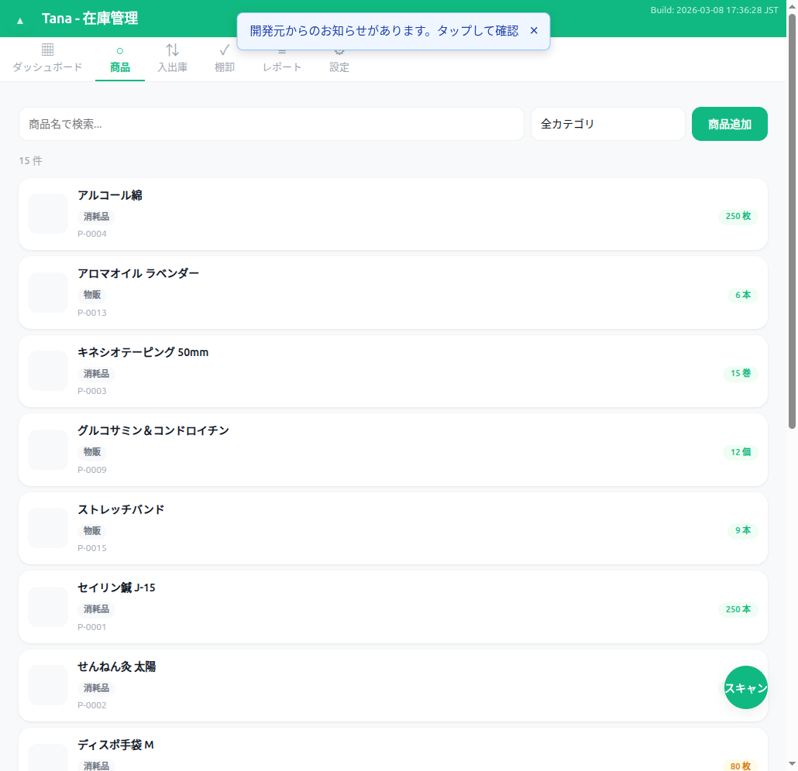
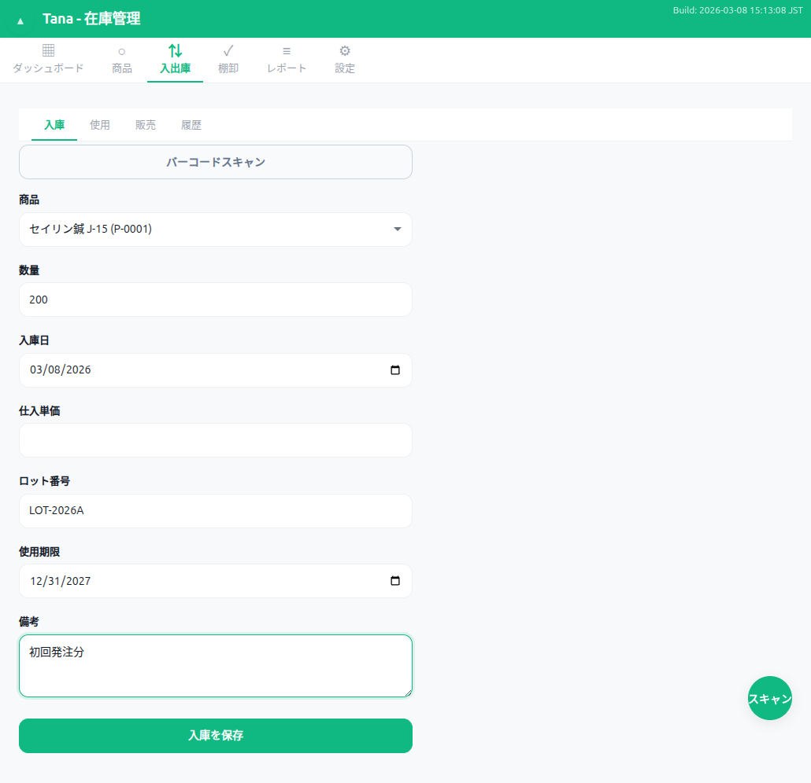
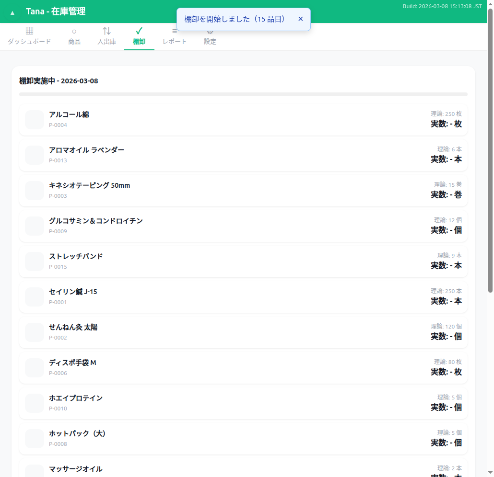
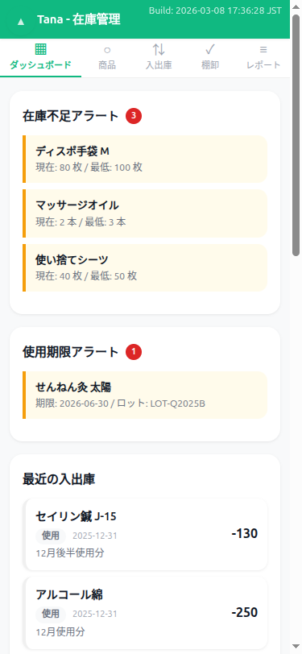

# 在庫管理、まだExcelで消耗してますか？

**月額0円・登録不要・3分で開始。** ブラウザだけで完結する、治療院・サロンのための在庫管理。

---

## こんなお悩み、ありませんか？

> 「施術に使う消耗品、在庫切れに気づくのがいつもギリギリ...」

> 「物販商品の期限管理、Excelで手入力するたびにミスが出る...」

> 「月額数千円のクラウドサービス、うちの規模には正直もったいない...」

治療院・サロンにとって、在庫管理は**本業ではない**はず。
でも、施術用消耗品が切れれば施術できない。物販商品の期限が切れれば廃棄ロスになる。

**Tana は、そんなあなたのために作りました。**

---

## Tana とは

ブラウザを開くだけで使える、**完全無料**の在庫管理アプリケーションです。

<table>
<tr>
<td align="center" width="33%">
<h3>ずっと無料</h3>
月額0円。隠れた課金もありません。 小さな事業の利益を圧迫しません。
</td>
<td align="center" width="33%">
<h3>かんたん操作</h3>
アカウント登録不要。 ブラウザを開いて3分で最初の商品登録が完了。
</td>
<td align="center" width="33%">
<h3>安心・安全</h3>
データはお使いの端末内に保存。 サーバーへの送信は一切ありません。
</td>
</tr>
</table>

---

## 主な機能

### 商品管理 — 消耗品も物販もまとめて管理

施術用消耗品と物販商品を、**ひとつの画面で一括管理**。
バーコードスキャンで素早く検索・登録ができます。

---

### 入出庫記録 — 5種類の取引で正確な在庫追跡

入庫・使用・販売・廃棄・調整の5種類で、あらゆる在庫変動を記録。
ロット番号と使用期限で細かな追跡も可能です。

---

### 棚卸 — スマホでサクサクカウント

テンキー入力で素早くカウント。システム在庫との差異を自動検出し、
調整トランザクションをワンクリックで生成します。

---

### 期限管理 — 期限切れをゼロに

使用期限の近い商品をダッシュボードで一目で把握。
期限切れ前にアラートで通知し、廃棄ロスを最小化します。

---

### スマホでもサクサク操作

外出先でもスマートフォンから在庫の確認・入出庫記録が可能。
PCと同じ機能を、レスポンシブデザインで快適に使えます。

---

## 選ばれる理由

| 比較項目 | Excel | 有料クラウドサービス | Tana |
|---------|-------|-------------------|------|
| **料金** | Office購入費 | 月額1,000〜5,000円 | **無料** |
| **導入の手軽さ** | テンプレ探しから | アカウント登録が必要 | **ブラウザで即開始** |
| **バーコード対応** | 不可 | 別途機器が必要な場合も | **スマホカメラで対応** |
| **期限管理** | 手動で対応 | 対応 | **自動アラート** |
| **棚卸機能** | 手動で対応 | 対応 | **テンキー入力+自動差異検出** |
| **データの安全性** | ファイル管理が必要 | サーバーに依存 | **端末内で完結** |
| **オフライン利用** | 対応 | 不可 | **対応** |

---

## こんな方におすすめ

**整骨院・接骨院**
テーピング、湿布、施術用オイルなどの消耗品在庫を正確に把握。発注タイミングを逃しません。

**美容室・エステサロン**
シャンプー、トリートメント、美容液の在庫と期限を一括管理。物販商品の期限切れによる廃棄ロスをゼロに。

**鍼灸院・マッサージ院**
鍼、灸、マッサージオイルなどの消耗品をバーコードで効率管理。棚卸も短時間で完了。

**ネイルサロン・まつげサロン**
ジェル、グルー、リムーバーなど期限の短い商材を確実に管理。期限アラートで安全な施術を維持。

---

## セキュリティとプライバシー

Tana はあなたのデータを**一切外部に送信しません**。

- すべてのデータは、お使いのブラウザ内（IndexedDB）に保存されます
- サーバーとの通信は、アプリ本体の読み込み時のみ
- インターネット接続がなくても動作します（PWA対応）
- JSON形式でのエクスポートに対応。バックアップや端末移行も安心です

「クラウドに商品データを預けるのは不安...」という方にこそ、おすすめです。

---

## はじめかた — たった3ステップ

### Step 1: アクセスする

ブラウザで Tana を開くだけ。インストールもアカウント登録も不要です。

### Step 2: サンプルデータで体験する

設定画面からサンプルデータを読み込めます。
まずは触って、使い心地を確かめてください。

### Step 3: 自院の情報を入力して運用開始

設定画面で施設名・低在庫アラートの閾値を設定すれば、すぐに実務で使えます。

---

## よくある質問

**Q. 本当に無料ですか？**
はい、完全無料です。広告表示もありません。オープンソース（MIT License）で公開されています。

**Q. データはどこに保存されますか？**
お使いのブラウザ内（IndexedDB）に保存されます。外部サーバーへの送信は一切行いません。

**Q. バーコードスキャンに対応していますか？**
はい。スマートフォンのカメラを使って、JANコード（バーコード）をスキャンできます。

**Q. オフラインで使えますか？**
はい。PWA（Progressive Web App）対応のため、一度アクセスすればオフラインでも利用できます。ホーム画面に追加すれば、アプリのように起動できます。

**Q. データのバックアップはできますか？**
はい。JSON形式でエクスポート・インポートが可能です。端末の買い替え時にも、ファイル一つでデータを移行できます。

**Q. スマートフォンでも使えますか？**
はい。PC・タブレット・スマートフォンに対応したレスポンシブデザインです。

**Q. 使用期限の管理はできますか？**
はい。ロットごとに使用期限を記録し、期限切れが近い商品をダッシュボードで自動表示します。

---

## 今すぐ、無料で始めましょう

在庫管理に費やしていた時間を、**施術やお客様対応に集中する時間**に変えませんか？

アカウント登録不要。ブラウザを開くだけで、すぐに使い始められます。

[**→ Tana を試してみる**](index.html)

使い方を詳しく知りたい方は、[**→ ユーザーマニュアル**](manual.html) をご覧ください。

---

Tana はオープンソースソフトウェアです（MIT License）。
