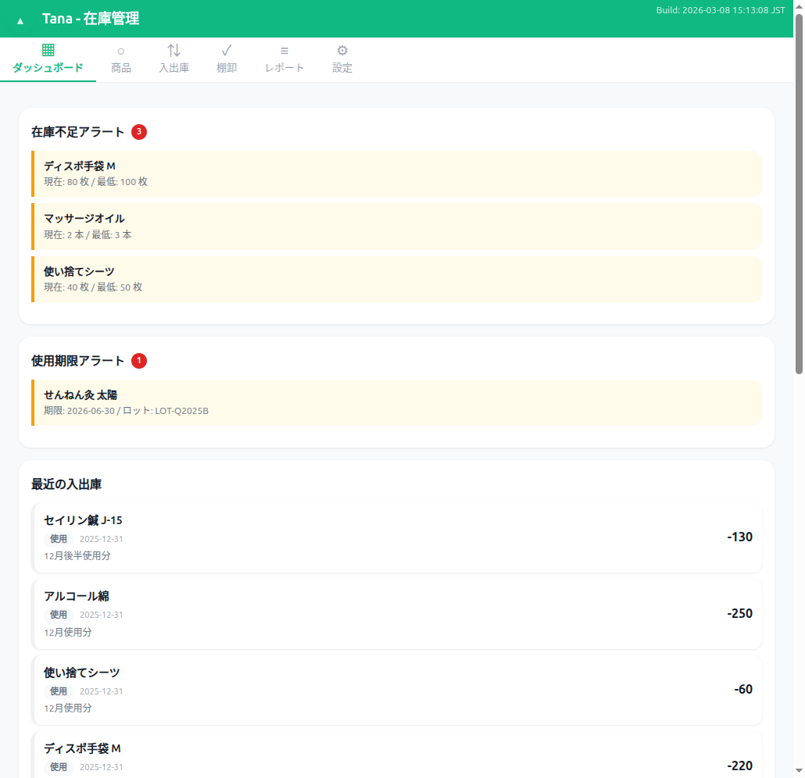
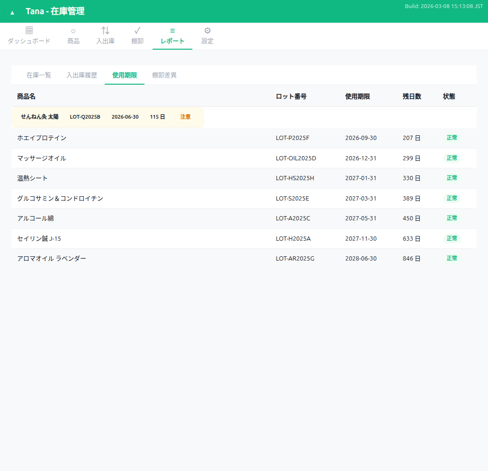
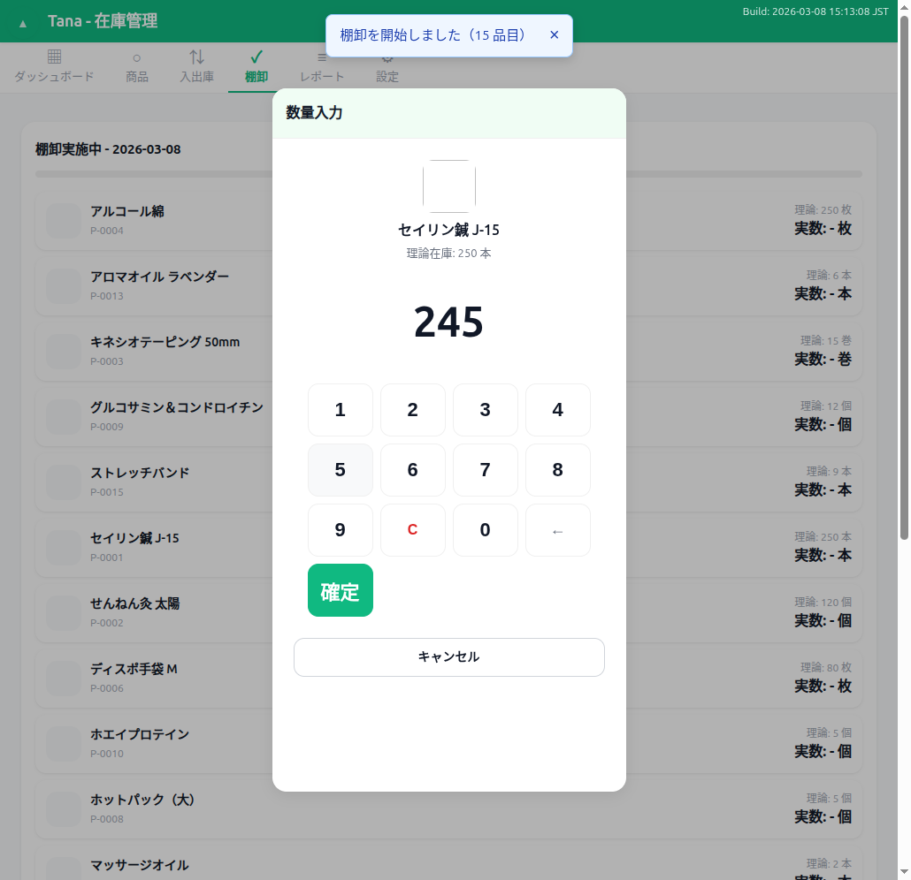
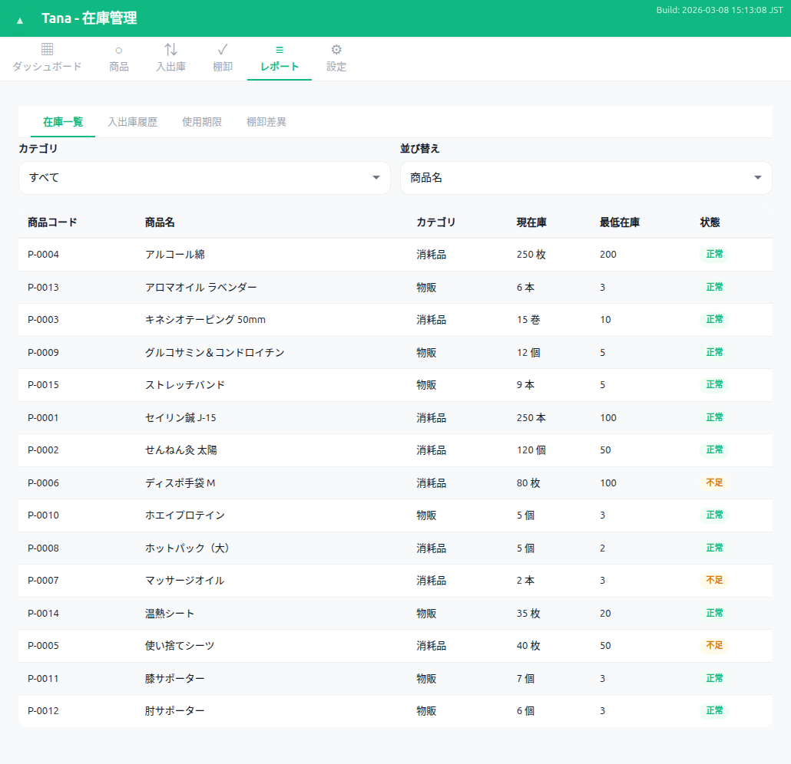
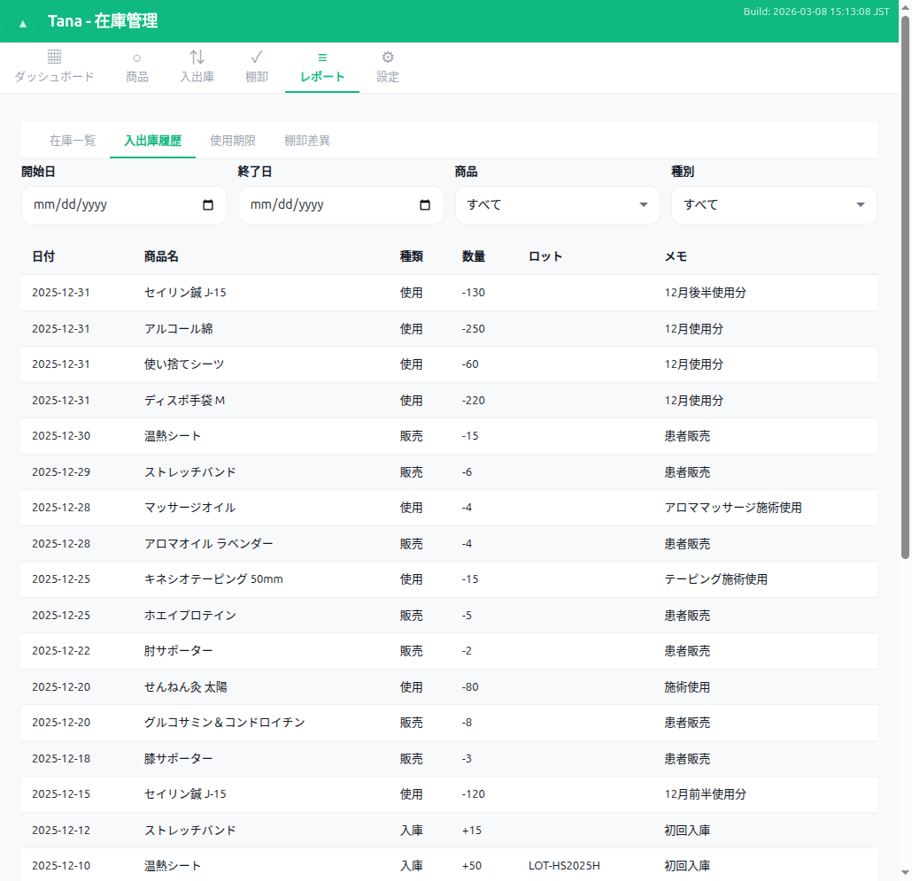
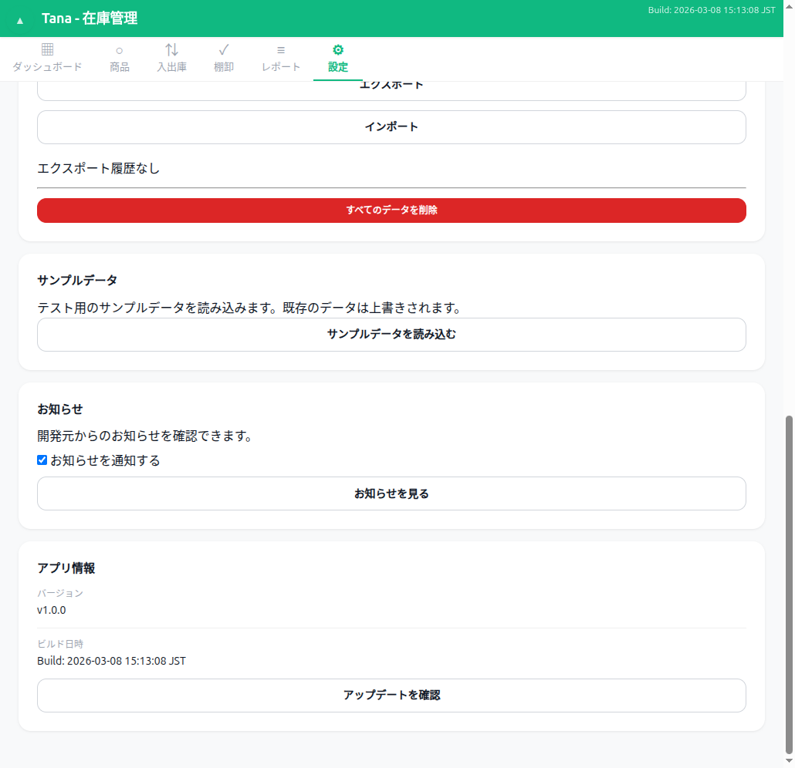
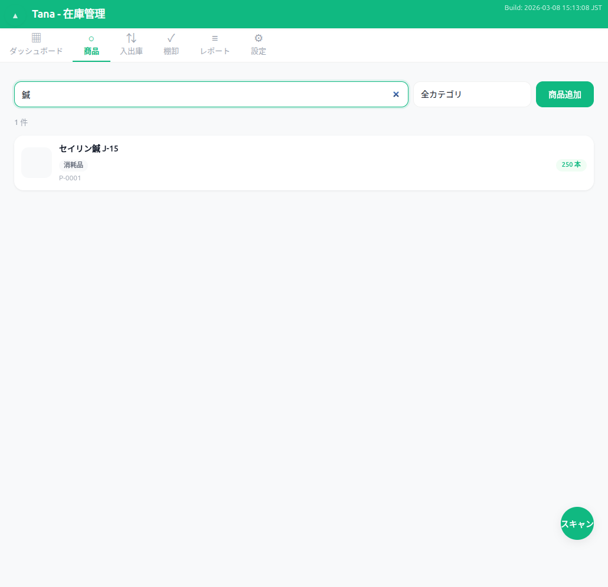

# Tana 活用事例 — さくらクリニックの在庫管理

**「もう、在庫切れで施術を中断することはありません」**

東京・渋谷の鍼灸院「さくらクリニック」は、施術用消耗品と物販商品の在庫管理に Tana を導入しました。院長の田中先生が一人で運営する小さな治療院が、どのように Tana を活用しているのか — 8つのシーンでご紹介します。

---

## UC1: 開業準備 — 初期セットアップ

Tana を開いたら、まず設定タブで事業者情報を登録します。店舗名・住所・電話番号を入力して保存するだけ。アカウント登録もメールアドレスも不要です。

続いて、商品タブから最初の商品を登録します。消耗品（施術用の鍼）と物販商品（サプリメント）をそれぞれ登録。カテゴリ・単位・仕入価格・最低在庫数など、必要な情報をフォームに入力するだけです。

**ポイント**
- 商品コードは自動採番（P-0001, P-0002...）、手入力不要
- JANコード（バーコード）を登録しておけば、入庫時にスキャンで素早く商品を特定できる
- 使用期限管理のON/OFFを商品ごとに設定可能

---

## UC2: 初回入荷 — 在庫の受け入れ

商品が届いたら、入出庫タブの「入庫」サブタブで入庫記録をつけます。商品を選択し、数量・ロット番号・使用期限を入力。使用期限管理がONの商品では、ロット番号と期限の入力欄が自動で表示されます。

入庫を記録すると、ダッシュボードにリアルタイムで反映されます。登録商品数・総在庫数が一目で確認でき、最近の入出庫履歴も表示されます。

**ポイント**
- バーコードスキャンで商品を素早く特定して入庫可能
- ロット単位の在庫追跡で、どのロットをいつ入荷したか記録が残る
- 仕入単価を記録することで、在庫金額の把握も可能

---

## UC3: 日常業務 — 消費と販売

毎日の施術で使った消耗品は「使用」サブタブで記録。患者さんへの物販は「販売」サブタブで記録します。在庫数はリアルタイムに減算され、ダッシュボードに反映されます。

在庫が最低在庫数を下回ると、ダッシュボードの「在庫不足アラート」に警告が表示されます。発注タイミングを見逃しません。

**ポイント**
- 使用・販売の記録は商品を選んで数量を入れるだけのシンプル操作
- 最低在庫数は商品ごとに設定可能。消費ペースに合わせて調整できる
- アラートはバッジ付きで件数表示。見逃しを防止

---

## UC4: 期限管理 — 使用期限の確認と対応

使用期限が近づいた商品は、ダッシュボードの「使用期限アラート」で自動通知されます。さらに詳しく確認したいときは、レポートタブの「使用期限」サブタブへ。

ロットごとに期限の残日数とステータスが一覧表示され、色分けバッジで視覚的に状況を把握できます。

**ポイント**
- 「注意」（黄色）・「期限切れ」（赤色）・「正常」（緑色）のバッジで直感的に判断
- アラート日数は設定タブでカスタマイズ可能（デフォルト30日）
- 使用期限管理OFFの商品はレポートに含まれないため、ノイズなし

---

## UC5: 月次棚卸 — 在庫確認と調整

月末の棚卸は、棚卸タブから「新規棚卸を開始」をタップするだけ。全商品がリストアップされ、理論在庫（システム上の在庫数）が表示されます。

商品をタップするとテンキーオーバーレイが表示され、実際にカウントした数をスマホでサクサク入力できます。

**ポイント**
- テンキーはスマホでの片手操作を想定した大きなボタン設計
- 差異（実在庫 - 理論在庫）はリアルタイム表示
- 棚卸完了時に調整取引が自動生成され、システム在庫が実在庫に合わせて補正される

---

## UC6: レポート活用 — 経営分析

レポートタブでは、4種類のレポートで在庫状況を多角的に分析できます。

**在庫一覧レポート** — 全商品の在庫数・最低在庫・状態を一覧表示。カテゴリフィルターや並び替えで、必要な情報を素早く抽出できます。

**入出庫履歴レポート** — 日付・商品・種別でフィルタリングし、過去の取引を詳細に確認。仕入れの傾向分析や、消費ペースの把握に役立ちます。

**ポイント**
- カテゴリフィルター（消耗品/物販）で表示を切り替え
- 在庫数の少ない順/多い順で並び替え。発注優先度の判断に
- 使用期限レポート・棚卸差異レポートも同じタブから切り替え可能

---

## UC7: データ保全 — バックアップと復元

スマートフォンの機種変更や万が一のデータ消失に備えて、設定タブの「データ管理」からワンタップでバックアップ。JSON形式のファイルとしてダウンロードされます。

**ポイント**
- エクスポートファイルには商品・取引・棚卸・設定のすべてが含まれる
- インポートで別の端末にデータをそのまま復元可能
- データはすべて端末内（ブラウザ）に保存。外部サーバーへの送信は一切なし

---

## UC8: 商品管理 — 検索・編集・削除

商品数が増えても大丈夫。検索ボックスに商品名やJANコードを入力すれば、瞬時に絞り込めます。カテゴリフィルターとの組み合わせで、さらに効率的に目的の商品を見つけられます。

**ポイント**
- 商品名の部分一致検索とJANコード検索の両方に対応
- 商品の編集（名前・価格・最低在庫数など）はタップ操作で完了
- 取り扱い終了商品は論理削除。過去の取引履歴はそのまま保持

---

## まとめ — Tana がさくらクリニックにもたらした変化

Tana の導入により、さくらクリニックの在庫管理は大きく変わりました。

- **在庫切れゼロ** — 低在庫アラートで発注タイミングを逃さない
- **期限管理の自動化** — 使用期限レポートで期限切れリスクを事前に把握
- **棚卸時間の短縮** — テンキー入力と自動調整で、月末の棚卸が数分で完了
- **データに基づく発注** — 入出庫履歴レポートで消費傾向を分析し、適切な発注量を判断

すべてブラウザだけで完結。月額料金もアカウント登録も不要。データは端末内に安全に保存されます。

---

## 今すぐ試してみましょう

サンプルデータを読み込めば、このページで紹介した機能をすぐに体験できます。

[**Tana を試してみる →**](index.html)

使い方を詳しく知りたい方は [**ユーザーマニュアル →**](manual.html) をご覧ください。

Tana の機能概要・比較は [**プロモーションページ →**](promotion.html) をご覧ください。

---

Tana はオープンソースソフトウェアです（MIT License）。
