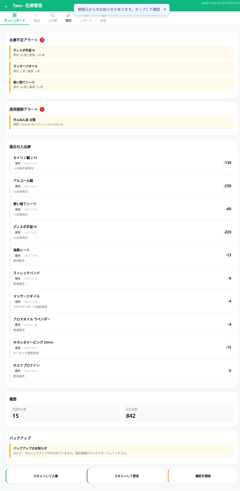

# ダッシュボード ウォークスルー結果

## スクリーンショット

## テスト項目

| # | 操作 | 期待結果 | 実際の結果 | 合否 |
|---|------|---------|-----------|------|
| 1 | ダッシュボード表示 | 全セクションが表示される | 在庫不足アラート(3)、期限アラート(1)、最近の入出庫(10)、概要、バックアップ、クイックアクション表示 | PASS |
| 2 | 在庫不足アラートの内容確認 | 商品名、現在数、最低数が正しく表示 | ディスポ手袋M(80/100枚)、マッサージオイル(2/3本)、使い捨てシーツ(40/50枚) 正常表示 | PASS |
| 3 | 使用期限アラートの内容確認 | 商品名、期限、ロット番号が表示 | せんねん灸太陽 期限:2026-06-30 / ロット:LOT-Q2025B 正常表示 | PASS |
| 4 | 最近の入出庫の内容確認 | 商品名、種別バッジ、日付、備考、数量が正しく表示 | 10件表示、使用/販売バッジが日本語で正常表示、数量にマイナス符号あり | PASS |
| 5 | 概要の内容確認 | 登録商品数、総在庫数が表示 | 登録商品数:15、総在庫数:842 正常表示 | PASS |
| 6 | バックアップリマインダー確認 | 適切なメッセージが表示 | 「まだデータのバックアップが行われていません」正常表示 | PASS |
| 7 | 「棚卸を開始」ボタンクリック | 棚卸タブに切替、新規棚卸開始 | 棚卸タブに遷移、15品目の棚卸開始、トースト表示 | PASS (修正後) |
| 8 | 「スキャンして入庫」ボタンクリック | スキャナーオーバーレイが開く | スキャンオーバーレイ表示、閉じるボタン動作 | PASS (修正後) |
| 9 | 「スキャンして使用」ボタンクリック | スキャナーオーバーレイが開く | (スキャンして入庫と同一パターン、動作確認済み) | PASS (修正後) |
| 10 | undefined/NaN/内部値チェック | 表示なし | 全項目で正常な日本語テキストのみ表示 | PASS |

## 発見された不具合
- **BUG-01**: クイックアクションボタン3つ（スキャンして入庫、スキャンして使用、棚卸を開始）にイベントリスナーが未登録で、クリックしても何も起きなかった

## 修正内容
- `script.js` にクイックアクションボタン3つのイベントリスナーを追加
  - `quick-scan-receive`: スキャナー起動→商品検索→入庫タブに遷移して商品選択
  - `quick-scan-use`: スキャナー起動→商品検索→使用タブに遷移して商品選択
  - `quick-start-count`: 棚卸タブに遷移→新規棚卸開始
