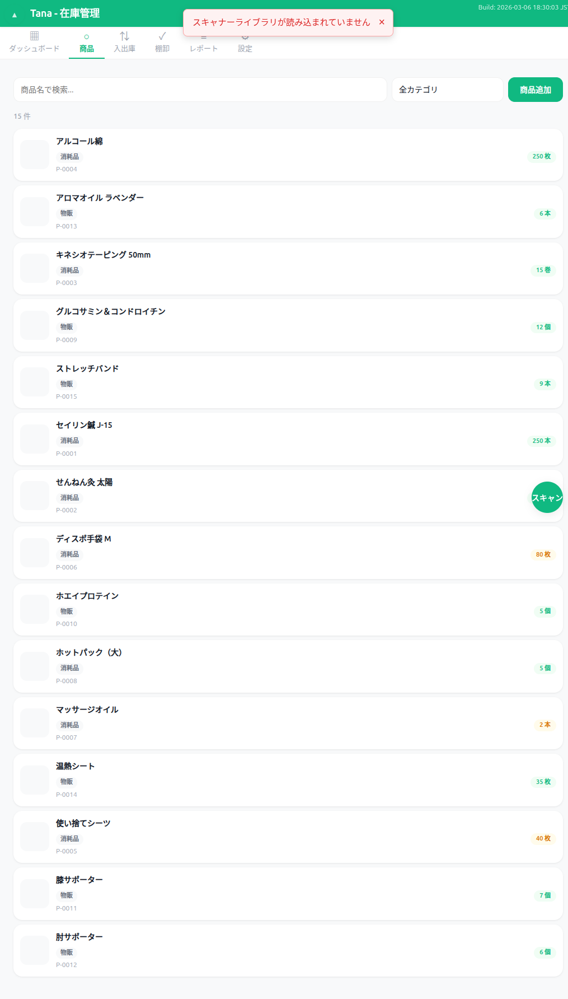

# 商品一覧 ウォークスルー結果

## スクリーンショット

## テスト項目

| # | 操作 | 期待結果 | 実際の結果 | 合否 |
|---|------|---------|-----------|------|
| 1 | 商品一覧表示 | 全商品がカード形式で表示 | 15件正常表示（名前、カテゴリバッジ、商品コード、在庫数） | PASS |
| 2 | カテゴリフィルタのラベル | 日本語で「消耗品」「物販」と表示 | 修正前:「consumable」「retail」/ 修正後:「消耗品」「物販」 | PASS (修正後) |
| 3 | カテゴリフィルタで消耗品を選択 | 消耗品のみ表示 | 8件に絞り込まれ正常動作 | PASS |
| 4 | 検索ボックスに「セイリン」入力 | 該当商品のみ表示 | 1件（セイリン鍼 J-15）に絞り込み | PASS |
| 5 | 商品カードクリック | 商品詳細オーバーレイ表示 | 正常に詳細表示 | PASS |
| 6 | 商品追加ボタン | 商品登録フォーム表示 | 空フォームが表示、商品コード自動生成 | PASS |
| 7 | バーコードスキャンFABボタン | スキャナーが起動 | ボタン表示確認（スキャナーは環境依存） | PASS |
| 8 | undefined/NaN/内部値チェック | 表示なし | カテゴリバッジは日本語表示、数値正常 | PASS (修正後) |

## 発見された不具合
- **BUG-02**: カテゴリフィルタのドロップダウンが内部値（consumable/retail）を表示していた

## 修正内容
- `script.js` L369: `option.textContent = cat` → `option.textContent = TanaCalc ? TanaCalc.getCategoryLabel(cat) : cat`
