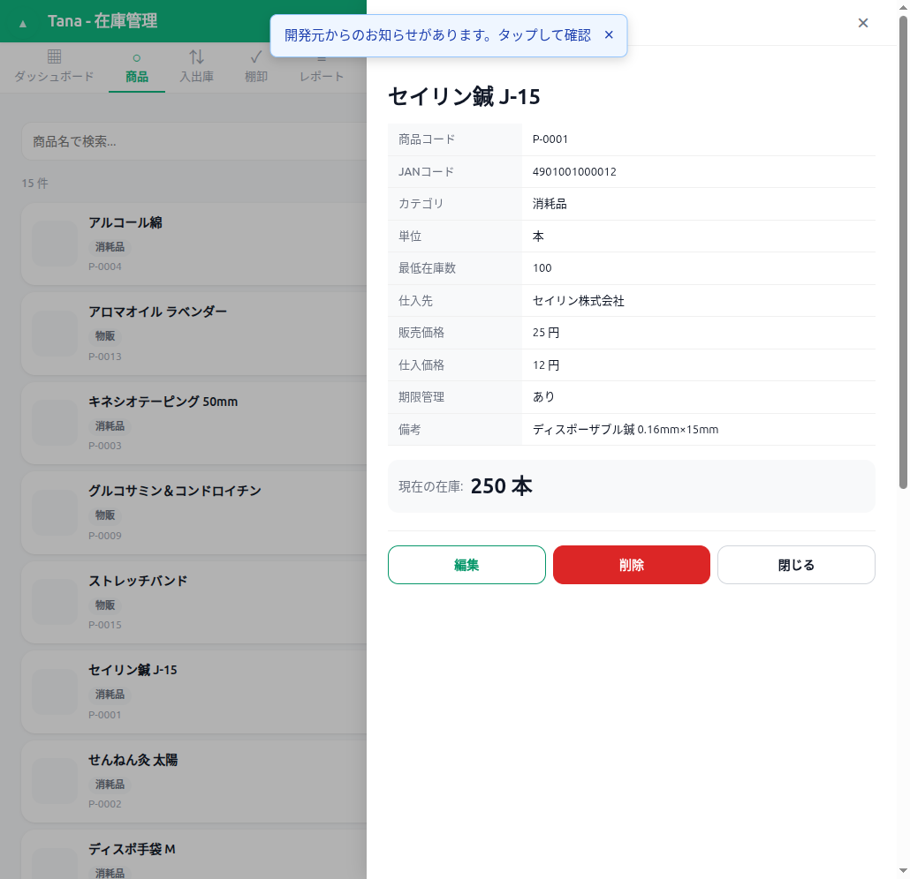

# 商品詳細 ウォークスルー結果

## スクリーンショット

## テスト項目

| # | 操作 | 期待結果 | 実際の結果 | 合否 |
|---|------|---------|-----------|------|
| 1 | 商品カードクリック→詳細表示 | 全フィールドが正しく表示 | 商品コード、JAN、カテゴリ（日本語）、単位、最低在庫、仕入先、価格、期限管理、備考 全て正常 | PASS |
| 2 | 在庫数表示 | 正しい在庫数が表示 | 修正前:上部250本/下部0と矛盾 修正後:「現在の在庫: 250 本」のみ | PASS (修正後) |
| 3 | ボタン重複 | 1セットのみ | 修正前:2セット重複 修正後:編集/削除/閉じるの1セット | PASS (修正後) |
| 4 | 編集ボタン | 編集フォームが開く | 正常にフォームに遷移 | PASS |
| 5 | 閉じるボタン | 詳細が閉じる | 正常に閉じる | PASS |
| 6 | undefined/NaN/内部値チェック | 表示なし | カテゴリ「消耗品」、価格「25 円」等全て正常 | PASS |

## 発見された不具合
- **BUG-03**: 商品詳細で在庫表示が二重化（動的HTML内「在庫: 250本」＋静的HTML「現在の在庫: 0」）
- **BUG-04**: 編集/削除ボタンが二重化（動的HTML内のinlineボタン＋静的HTMLのボタン）

## 修正内容
- `script.js` showProductDetail(): 動的HTMLから在庫表示と編集/削除ボタンを削除
- 静的HTMLの `product-detail-stock` 要素を正しい在庫値で更新するコードを追加
- 静的HTMLの編集/削除ボタンにonclickハンドラを動的に設定
