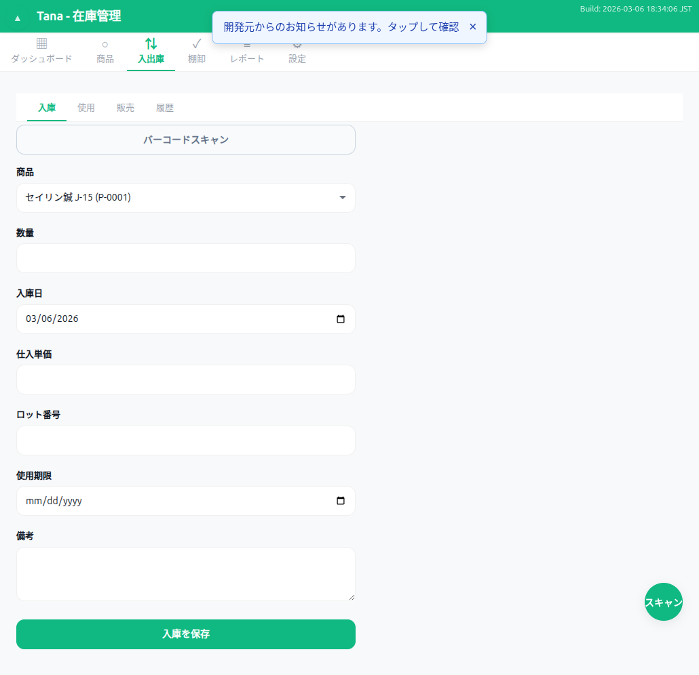

# 入庫フォーム ウォークスルー結果

## スクリーンショット

## テスト項目

| # | 操作 | 期待結果 | 実際の結果 | 合否 |
|---|------|---------|-----------|------|
| 1 | フォーム表示 | 商品選択、数量、日付、仕入単価、備考、保存ボタン | 全フィールド表示、日付に今日の日付がプリフィル | PASS |
| 2 | 商品選択ドロップダウン | 全15商品が表示 | 全商品名(商品コード)形式で表示 | PASS |
| 3 | 期限管理商品を選択 | ロット番号/使用期限フィールドが表示 | 修正前:表示されない 修正後:正常表示 | PASS (修正後) |
| 4 | バーコードスキャンボタン | スキャナー起動 | ボタン存在確認（環境依存） | PASS |
| 5 | undefined/NaN/内部値チェック | 表示なし | 全フィールド正常 | PASS |

## 発見された不具合
- **BUG-05**: 期限管理商品を選択してもロット番号/使用期限フィールドが表示されない。JS側が`receive-lot-fields`を探すがHTML側のIDは`receive-lot-number-group`/`receive-expiry-date-group`

## 修正内容
- `script.js` onTransactionProductChange(): 個別のグループIDを使用するよう修正
